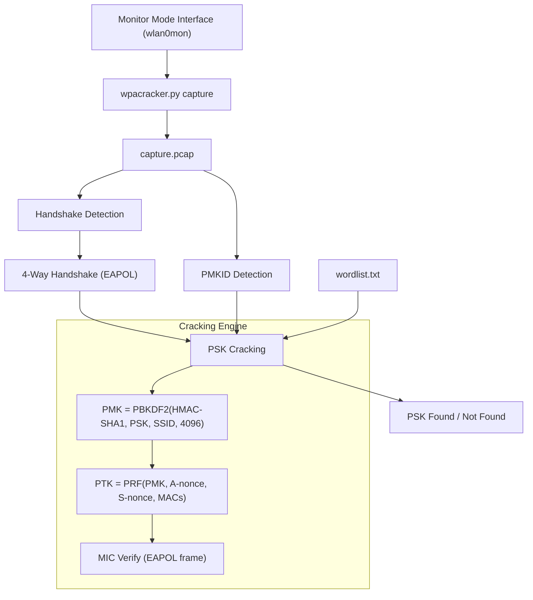

# WPA-Cracker

WPA/WPA2 handshake capture and PSK cracking tool with PMKID support. Uses scapy for monitor-mode capture and on-the-fly handshake detection. Output compatible with aircrack-ng format so you can pipe results into your existing workflows.

> Field notes from a weekend project after realizing aircrack-ng's parsing is arcane and I wanted something that works with scapy directly. IEEE 802.11i terminology throughout because the standard is the standard.

## Flow



## IEEE 802.11 Background

For the uninitiated — WPA/WPA2-PSK uses a 4-way handshake:

1. AP → STA: A-nonce (AP's random number)
2. STA → AP: S-nonce (client's random number) + MIC (message integrity code)
3. AP → STA: GTK (group temporal key) + MIC
4. STA → AP: ACK

Cracking works by: PSK → PMK (PBKDF2) → PTK (PRF-384) → Compare MIC. If MIC matches, the PSK is correct.

### PMKID Attack

PMKID = HMAC-SHA1(PMK, "PMK Name" + AP MAC + STA MAC)

Some APs include PMKID in the first EAPOL frame. If present, you don't need the full handshake — just the first frame.

## Usage

### Capture from Monitor Mode

```
# Set interface to monitor mode first:
# sudo ip link set wlan0 down
# sudo iw dev wlan0 set type monitor
# sudo ip link set wlan0 up

python wpacracker.py -i wlan0mon -w wordlist.txt
```

### Analyze a Captured Pcap

```
python wpacracker.py -r capture.pcap -w wordlist.txt
```

### Options

| Flag | Description |
|------|-------------|
| `-i` | Monitor mode interface for live capture |
| `-r` | Read from pcap file (instead of live) |
| `-w` | Wordlist for PSK cracking |
| `-o` | Output file for results |
| `--timeout` | Capture duration in seconds (default: 60) |
| `--pmkid-only` | Only attempt PMKID attack |
| `--bssid` | Filter by BSSID (MAC) |
| `--essid` | Filter by SSID |

### Output Format

```
WPA-Cracker Results
====================
BSSID              ESSID           PSK               Status
AA:BB:CC:DD:EE:FF  MyNetwork       hunter2           FOUND
11:22:33:44:55:66  GuestNet        [not in list]     NOT FOUND
```

## Handshake Detection

The tool looks for EAPOL frames (EtherType 0x888E, IEEE 802.1X) with Key Descriptor Type = 2 (RSN Key Descriptor). A full handshake requires all 4 messages of the 4-way handshake. PMKID is extracted from message 1 if present.

## Cracking Engine

- PBKDF2-HMAC-SHA1 with 4096 iterations (per IEEE 802.11i-2004)
- PTK derivation per IEEE 802.11-2012 Section 11.6.1.2
- MIC verification using NIST SP 800-38B CCM mode for EAPOL-Key frames

### Performance

- ~500 PSK attempts/second (single core, PBKDF2 bound)
- Hashcat is ~100x faster — use this for testing/learning, not production cracking

## TODO

- [ ] WPA3/SAE handshake capture (different frame format — need to implement)
- [ ] Hashcat output mode (-o hashcat.hc22000)
- [ ] PMKID-only mode doesn't check message ordering properly. FIXME in line 203
- [ ] Live capture on 5GHz needs `iw` regulatory domain settings
- [ ] Beacon parsing for hidden SSIDs (Probe Response fallback)
- [ ] GPU acceleration via pyopencl

## Known Issues

- Monitor mode setup requires root. Run with sudo.
- scapy's `dot11` layer parsing is slow on busy channels. Use `--timeout` to limit capture.
- PMKID detection is heuristic — some APs send it, some don't. If PMKID not found, falls back to handshake.
- The PTK derivation doesn't handle BIP (Broadcast Integrity Protocol) GTK — irrelevant for cracking but noted.
- FIXME: PMKID calculation in pmkid_crack() doesn't match hashcat output for some corner cases. Need to verify with reference implementation.

## License

MIT. Only test on networks you own or have written permission to assess.
